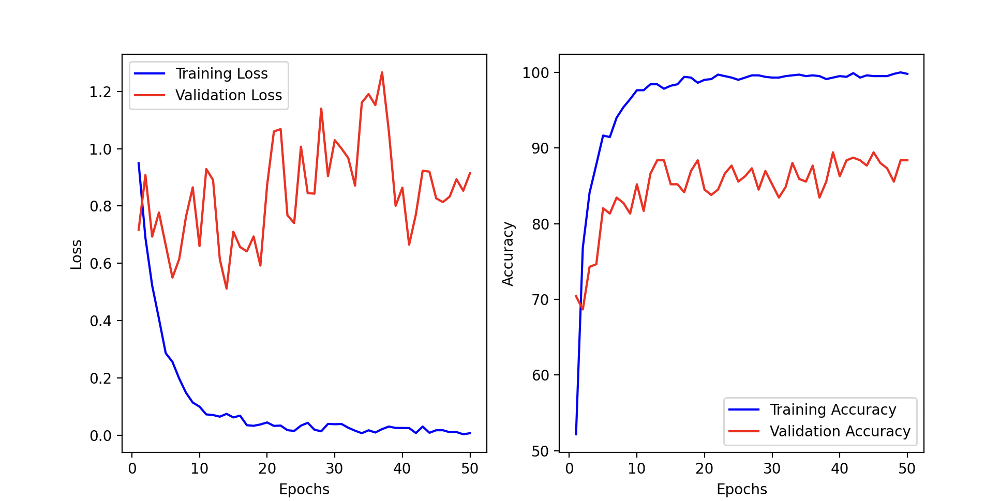

# Flower Emotion Classification Project

## Overview

This project is designed to classify human-drawn flowers into one of three categories: **happy**, **sad**, or **angry**. 
!!!Due to the limited availability of real-world data, I utilized DALL-E for data generation through the script data_generation.py. This allowed me to create synthetic images of flowers labeled as “happy,” “sad,” and “angry,” .!!!

The project includes the following components:
1. A **Flask web application** (`app.py`) where users can draw flowers on a blank canvas and get predictions.
3. A fully trained Convolutional Neural Network (CNN) model to classify the flowers.
4. Tools for **data augmentation** 

---

## Directory Structure

```
.
├── app.py                   # Flask application for prediction
├── augmented.py             # Data augmentation script
├── data_generation.py       # Script for generating dataset
├── flowers/                 # Original dataset folder
├── flowers_augmented/       # Augmented dataset folder
├── my_flowers/              # User-labeled flowers folder (created by the labeling app)
├── flower_model.pth         # Pre-trained model file
├── main_training.py         # Main training script
├── testing.py               # Model testing script
├── templates/               # HTML templates for the Flask app
└── README.md                # Documentation
```

---

## Features

### Flask Application (`app.py`)
- Allows users to **draw a flower** on a canvas and get its emotion predicted as **happy**, **sad**, or **angry**.
- Simple and interactive interface.


### Data Augmentation
- Augments the dataset with techniques such as rotation, resizing, random erasing, and zooming.
- Ensures better generalization of the model by simulating diverse drawing styles.


---

## Performance Metrics

Below is the training and validation performance of the CNN model:



**Observations:**
- The training loss consistently decreases, indicating proper learning.
- Validation accuracy stabilizes at a high percentage (~86%), showing good generalization.

---

## How to Use

### Prerequisites
1. Python 3.9 or above.
2. Install the required libraries using:
   ```bash
   pip install -r requirements.txt
   ```
3. Ensure you have the following folder structure:
   ```
   flowers/
     ├── train/
     │   ├── happy/
     │   ├── sad/
     │   └── angry/
     └── valid/
         ├── happy/
         ├── sad/
         └── angry/
   ```

### Running the Flask Application
1. Start the application:
   ```bash
   python app.py
   ```
2. Open your browser and navigate to `http://127.0.0.1:5050`.
3. Draw a flower on the canvas and click "Predict" to see the classification.


